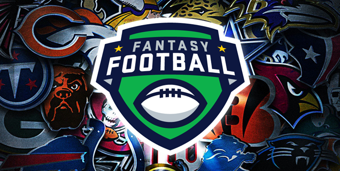

# Predicting NFL Success Using Fantasy Points

## How Fantasy Football Works

Fantasy football is a game in which the participants serve as general managers of virtual professional American football teams.

### The Draft
    Each season, fantasy football leagues hold a draft where each team drafts NFL players. These players are kept unless they are traded or dropped. No player can be owned by more than one team.
### Team Rosters
    Each team is allowed a certain number of players on its roster, as well as a specified number at each position that can or must be used in each game (the "starters"). Owners for each team then determine each week which players will start and which will be "benched". Just like in real football, bench players can become starters for various reasons: due to other players' injury, poor performance, or if another player's team has a bye that week.
    Each week, owners choose their starters before their players' real-world games start. Whether to sit or start a player is usually based on strategic considerations including the player's past and expected performance, defensive match-ups, etc.
    
### Scoring
    League managers earn team points based on their starting players' performances in weekly NFL games. Players accumulate points based on their stats. For example, a touchdown might be worth six points while each yard passed, rushed, or carried may be worth a certain number of points, and so on. Players earn points for passing, rushing, and receiving yards, along with touchdowns.

### Weekly Matchups
    Fantasy teams match up against a different fantasy team from the league each week. The team that receives the most points of the two receives a win for that week. A team's total is the sum of all players' points who were placed in a starting slot by the team owner for the day they were playing (as opposed to being on the bench, in which any points gained would not count). Teams with the best win-loss record advance to the playoffs.
    

## Dynasty Leagues

Dynasty leagues are drafted in the same way to a traditional season-long league, however they continue indefinitely. There will be a follow up draft each year for rookies (incoming college players).

## The Big Picture

Build a Dynasty!

Because you keep your roster year after year, it is imperative to draft incoming rookies that have a high probablity of success to replace aging players on your roster.

Using college player stats, physical measurements, and workout metrics, I built a model to predict average fantasy points per game over the players first 3 years in the NFL.

